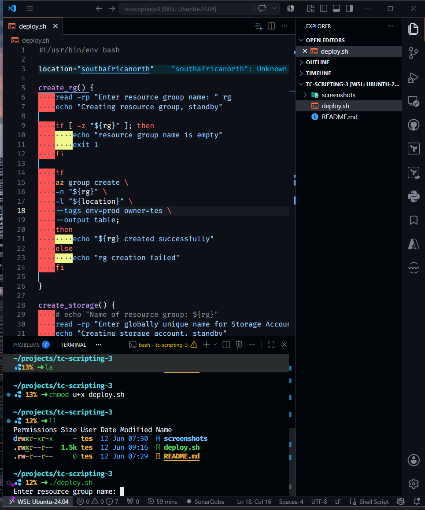
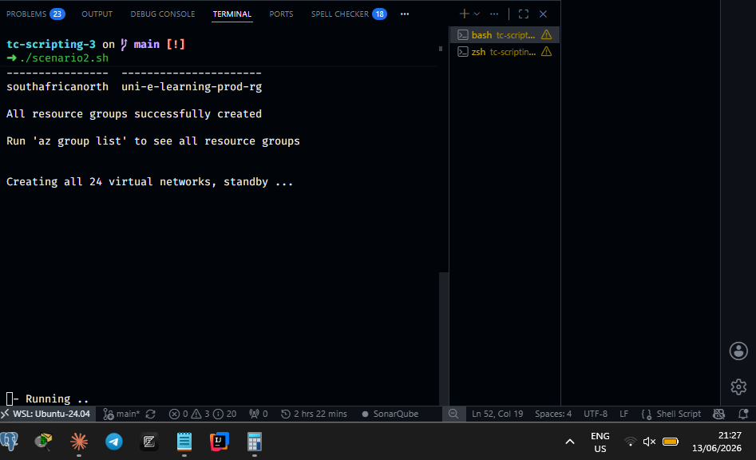

## Assignment3 (Scenario 1 & 2)

### Screenshots

##### Scenario 1 (deploy.sh)



##### Resource group creation (scenario 2)


##### Network creation (Scenario 2)



### Designing resource groups

I designed the resource groups to using the standard azure naming convention which is as follows: `company-service-environment-resource`

---

### Structure of resource groups

The structure of the university resource groups is as depicted in the diagram below:

* All departments have 3 resource groups each. For example, **admissions** department has:

uni-[department]-rg/
├── dev-rg/
│   ├── uni-[department]-dev-vnet
│   └── uni-[department]-dev-storage
├── staging-rg/
│   ├── uni-[department]-staging-vnet
│   └── uni-[department]-staging-storage
└── prod-rg/
    ├── uni-[department]-prod-vnet
    └── uni-[department]-prod-storage

| Resource group | Resources |
|---|---|
| `uni-admissions-dev-rg` | `uni-admissions-dev-vnet`, `uni-admissions-dev-store` |
| `uni-admissions-staging-rg` | `uni-admissions-staging-vnet`, `uni-admissions-staging-store` |
| `uni-admissions-prod-rg` | `uni-admissions-prod-vnet`, `uni-admkvissions-prod-store` |

---

        The resources will be created as follows:

        1. We have 4 departments and each department will have **3** resource groups (dev, prod and staging). This means that there will be a total of 12 resource groups (4 * 3).

        2. Now, each resource group will have **2** resources (a storage account and a virtual network). This means that 1 department (e.g. admissions) would have a total of 6 resources (3 resource groups * 2 resources). The diagram above illustrates this.

        3. Since we have 4 departments, there will be a total of 24 (6 * 4) resources.

---

### Support for more departments

The script caters stores the names of all departments in an array whose elements can be reduced or increased as required. Creating a resource group for a new department or **20 new departments** is as easy as appending their names to the array and re-running the script after.

---

### What I learned

* **Idempotency and tags:** From the previous assignment (assignment 2), I learnt that resources and resource group creation is idempotent (creating a resource/group with the same name as an resource does not overwrite the existing resource/group), **however, passing the tags flag updates the tags of the resource/group**.

For example, test-rg already exists with env set to prod and owner set to John and you run

```sh
az group create \
--name test-rg \
--location southafricanorth \
--tags env=test owner=Tes
```

env is changed from prod to test and owner is also changed from John to Tes.

* **Storage account naming constraints:** A virtual storage account must have a globally unique name of alphanumeric characters without spaces in between.

